### The following is a project that I worked on for a national wholesale plant distributer. The purpose of this project was to reduce the number of variables used to predict plant sales in Dallas. To do this, I used both Boruta analysis and Recursive Feature Elimination analysis to determine the most important data features. Next, I validated the analysis of these two variable reduction methods by testing multiple predictive models and comparing results.


##### First I load the raw data file, check the structure of the data to determine if it is in the correct measurement scale, and finally check for missing data.


```r
setwd("C:\\Users\\e16582\\Documents\\Datalore Projects\\Weather Data\\")
Weather_Data_Raw <- read.csv("Foliage_Dallas_Chicago v2.csv")
str(Weather_Data_Raw)
```

```
## 'data.frame':	2460 obs. of  42 variables:
##  $ Date..Year.              : int  2015 2015 2015 2015 2015 2015 2015 2015 2015 2015 ...
##  $ Date..Month.             : Factor w/ 12 levels "Apr","Aug","Dec",..: 5 5 5 5 5 5 5 5 5 5 ...
##  $ WeekOfYear               : int  1 1 1 1 1 1 2 2 2 2 ...
##  $ DayOfWeek                : Factor w/ 7 levels "Friday","Monday",..: 1 1 3 3 5 5 1 1 2 2 ...
##  $ City                     : Factor w/ 2 levels "Chicago","Dallas": 1 2 1 2 1 2 1 2 1 2 ...
##  $ Day                      : int  2 2 3 3 1 1 9 9 5 5 ...
##  $ Date                     : Factor w/ 1230 levels "1/1/2015","1/1/2016",..: 45 45 89 89 1 1 121 121 105 105 ...
##  $ HolidayText              : Factor w/ 15 levels "(blank)","Christmas Day",..: 1 1 1 1 11 11 1 1 1 1 ...
##  $ POS.Sales..              : num  434 633 408 1285 328 ...
##  $ Maximum.of.fog           : int  0 0 0 0 0 0 0 0 0 0 ...
##  $ Maximum.of.rain          : int  0 1 1 1 0 1 0 0 0 0 ...
##  $ Maximum.of.snow          : int  0 0 1 0 0 0 1 0 1 0 ...
##  $ Maximum.of.snow_fall     : int  0 0 0 0 0 0 0 0 1 0 ...
##  $ Maximum.of.mtd_snow      : int  0 0 0 0 0 0 7 0 4 0 ...
##  $ Maximum.of.since_jul_snow: int  2 0 3 0 2 0 10 0 7 0 ...
##  $ Maximum.of.snow_depth    : int  0 0 0 0 0 0 5 0 2 0 ...
##  $ Maximum.of.hail          : int  0 0 0 0 0 0 0 0 0 0 ...
##  $ Maximum.of.thunder       : int  0 1 0 1 0 0 0 0 0 0 ...
##  $ Maximum.of.tornado       : int  0 0 0 0 0 0 0 0 0 0 ...
##  $ Maximum.of.mean_temp     : int  25 39 32 46 23 35 6 33 2 34 ...
##  $ Maximum.of.mean_dewp     : int  18 38 30 37 10 33 -4 13 -4 19 ...
##  $ Maximum.of.mean_pressure : int  30 30 29 29 30 30 30 30 30 30 ...
##  $ Maximum.of.mean_wind_spd : int  5 6 6 9 15 4 17 11 10 9 ...
##  $ Maximum.of.mean_wind_dir : int  184 5 59 267 244 26 284 21 254 139 ...
##  $ Maximum.of.mean_visib    : int  10 4 3 10 10 4 8 10 6 10 ...
##  $ Maximum.of.humid         : int  0 0 0 0 0 0 0 0 0 0 ...
##  $ Maximum.of.max_temp      : int  34 41 34 54 32 37 11 39 6 46 ...
##  $ Maximum.of.min_temp      : int  15 37 29 38 14 33 0 27 -3 21 ...
##  $ Maximum.of.max_humid     : int  84 97 100 100 68 97 76 63 87 74 ...
##  $ Maximum.of.min_humid     : int  47 89 69 50 49 73 54 32 59 33 ...
##  $ Maximum.of.max_dew_pt    : int  21 40 34 39 15 36 5 21 2 27 ...
##  $ Maximum.of.min_dew_pt    : int  13 36 21 33 3 26 -10 6 -11 13 ...
##  $ Maximum.of.max_pressure  : int  30 30 30 30 30 30 30 30 30 30 ...
##  $ Maximum.of.min_pressure  : int  30 29 29 29 29 30 29 30 30 30 ...
##  $ Maximum.of.max_wind_spd  : int  12 12 13 15 24 8 30 22 22 20 ...
##  $ Maximum.of.min_wind_spd  : int  0 0 0 0 7 0 8 0 0 4 ...
##  $ Maximum.of.max_vis       : int  10 10 10 10 10 10 10 10 10 10 ...
##  $ Maximum.of.min_vis       : int  10 1 1 6 10 2 2 10 1 10 ...
##  $ Maximum.of.gdegree       : int  0 0 0 0 0 0 0 0 0 0 ...
##  $ Maximum.of.cooling_days  : int  0 0 0 0 0 0 0 0 0 0 ...
##  $ Maximum.of.heating_days  : int  40 26 33 19 42 30 59 32 63 31 ...
##  $ Maximum.of.precip        : int  0 0 0 0 0 1 0 0 0 0 ...
```

```r
colSums(sapply(Weather_Data_Raw,is.na))
```

```
##               Date..Year.              Date..Month. 
##                         0                         0 
##                WeekOfYear                 DayOfWeek 
##                         0                         0 
##                      City                       Day 
##                         0                         0 
##                      Date               HolidayText 
##                         0                         0 
##               POS.Sales..            Maximum.of.fog 
##                         0                         0 
##           Maximum.of.rain           Maximum.of.snow 
##                         0                         0 
##      Maximum.of.snow_fall       Maximum.of.mtd_snow 
##                         0                         0 
## Maximum.of.since_jul_snow     Maximum.of.snow_depth 
##                         0                         0 
##           Maximum.of.hail        Maximum.of.thunder 
##                         0                         0 
##        Maximum.of.tornado      Maximum.of.mean_temp 
##                         0                         0 
##      Maximum.of.mean_dewp  Maximum.of.mean_pressure 
##                         0                         0 
##  Maximum.of.mean_wind_spd  Maximum.of.mean_wind_dir 
##                         0                         0 
##     Maximum.of.mean_visib          Maximum.of.humid 
##                         0                         0 
##       Maximum.of.max_temp       Maximum.of.min_temp 
##                         0                         0 
##      Maximum.of.max_humid      Maximum.of.min_humid 
##                         0                         0 
##     Maximum.of.max_dew_pt     Maximum.of.min_dew_pt 
##                         0                         0 
##   Maximum.of.max_pressure   Maximum.of.min_pressure 
##                         0                         0 
##   Maximum.of.max_wind_spd   Maximum.of.min_wind_spd 
##                         0                         0 
##        Maximum.of.max_vis        Maximum.of.min_vis 
##                         0                         0 
##        Maximum.of.gdegree   Maximum.of.cooling_days 
##                         0                         0 
##   Maximum.of.heating_days         Maximum.of.precip 
##                         0                         0
```


##### It looks like there are no missing values. However, there are a number of variables that are currently read as integers that should be changed to a factor variable for modeling purposes such as 'Year'. I would also like check to see if there are any binary variables that need to be changed to factor. I can do this by looking at the number of unique levels for each variable. For integer variables with only two levels, I will change those to binary factors. I also notice that I need to rename a number of variables to remove the 'Maximum of' prefix.


```r
Weather_Data_Raw <- Weather_Data_Raw%>%
  rename_all(.funs = funs(sub("*Maximum.of.", "", names(Weather_Data_Raw))))
colnames(Weather_Data_Raw)[colnames(Weather_Data_Raw)=="POS.Sales.."]<-"Sales"
Weather_Data_Raw$Date..Year. <- as.factor(Weather_Data_Raw$Date..Year.)
Weather_Data_Raw$WeekOfYear <- as.factor(Weather_Data_Raw$WeekOfYear)
rapply(Weather_Data_Raw,function(x) length(unique(x)))
```

```
##    Date..Year.   Date..Month.     WeekOfYear      DayOfWeek           City 
##              4             12             53              7              2 
##            Day           Date    HolidayText          Sales            fog 
##             31           1230             15           1598              2 
##           rain           snow      snow_fall       mtd_snow since_jul_snow 
##              2              2              9             22             40 
##     snow_depth           hail        thunder        tornado      mean_temp 
##             18              2              2              1             97 
##      mean_dewp  mean_pressure  mean_wind_spd  mean_wind_dir     mean_visib 
##             90              3             25            354             11 
##          humid       max_temp       min_temp      max_humid      min_humid 
##              2            105             96             59             84 
##     max_dew_pt     min_dew_pt   max_pressure   min_pressure   max_wind_spd 
##             88             92              3              3             37 
##   min_wind_spd        max_vis        min_vis        gdegree   cooling_days 
##             14             10             11             45             30 
##   heating_days         precip 
##             68              6
```

```r
act_factors <- names(Weather_Data_Raw)[which(sapply(Weather_Data_Raw,function(x)length(unique(x))==2))]
Weather_Data_Raw[act_factors]<- lapply(Weather_Data_Raw[act_factors],factor)
```


##### Currently the data set has data for both Dallas and Chicago. I want to look at Dallas first and check how sales vary over time.
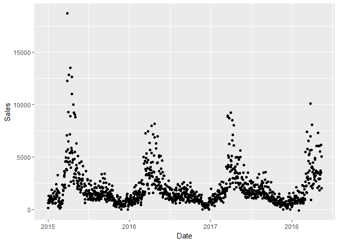<!-- -->


##### I removed the Date and Day variables since they are redundant. The tornado variable only has one level across the data set so it will not be helpful when modeling.


```r
Dallas <- subset(Dallas, select = -c(Day,Date,tornado))
```


##### Next I want to take a look at some descriptive statistics for the numerical data within my data set to make sure it makes sense. Except for the 'pressure' variables, which have only 3 unique levels, the data looks normal. I don't think that the 'Snow' variables will be predictive since we are look at Dallas, which doesn't get snow very often as the data shows.

```r
Dal_num_vars <- names(Dallas)[which(sapply(Dallas,is.numeric))]
Dal_num_df <- Dallas[Dal_num_vars]
Dal_summary_stats_num <- data.frame(vars= colnames(Dal_num_df),
                                    mean=rapply(Dal_num_df, function(x)round(mean(x,na.rm=T),3)),
                                    stddev=rapply(Dal_num_df, function(x)round(sd(x,na.rm=T),3)),
                                    unique=rapply(Dal_num_df, function(x)length(unique(x))),
                                    skew=rapply(Dal_num_df, function(x)round(skewness(x,na.rm=T),3)),
                                    nas=rapply(Dal_num_df, function(x)round(sum(is.na(x)),3)),stringsAsFactors=T)
kable(Dal_summary_stats_num[2:ncol(Dal_summary_stats_num)])%>%
    kable_styling(bootstrap_options = c("striped", "hover"))
```

<table class="table table-striped table-hover" style="margin-left: auto; margin-right: auto;">
 <thead>
  <tr>
   <th style="text-align:left;">   </th>
   <th style="text-align:right;"> mean </th>
   <th style="text-align:right;"> stddev </th>
   <th style="text-align:right;"> unique </th>
   <th style="text-align:right;"> skew </th>
   <th style="text-align:right;"> nas </th>
  </tr>
 </thead>
<tbody>
  <tr>
   <td style="text-align:left;"> Sales </td>
   <td style="text-align:right;"> 1976.093 </td>
   <td style="text-align:right;"> 1784.988 </td>
   <td style="text-align:right;"> 1027 </td>
   <td style="text-align:right;"> 2.830 </td>
   <td style="text-align:right;"> 0 </td>
  </tr>
  <tr>
   <td style="text-align:left;"> snow_fall </td>
   <td style="text-align:right;"> 0.004 </td>
   <td style="text-align:right;"> 0.085 </td>
   <td style="text-align:right;"> 3 </td>
   <td style="text-align:right;"> 21.987 </td>
   <td style="text-align:right;"> 0 </td>
  </tr>
  <tr>
   <td style="text-align:left;"> mtd_snow </td>
   <td style="text-align:right;"> 0.066 </td>
   <td style="text-align:right;"> 0.434 </td>
   <td style="text-align:right;"> 3 </td>
   <td style="text-align:right;"> 6.486 </td>
   <td style="text-align:right;"> 0 </td>
  </tr>
  <tr>
   <td style="text-align:left;"> since_jul_snow </td>
   <td style="text-align:right;"> 0.235 </td>
   <td style="text-align:right;"> 1.045 </td>
   <td style="text-align:right;"> 4 </td>
   <td style="text-align:right;"> 4.281 </td>
   <td style="text-align:right;"> 0 </td>
  </tr>
  <tr>
   <td style="text-align:left;"> snow_depth </td>
   <td style="text-align:right;"> 0.003 </td>
   <td style="text-align:right;"> 0.114 </td>
   <td style="text-align:right;"> 2 </td>
   <td style="text-align:right;"> 34.986 </td>
   <td style="text-align:right;"> 0 </td>
  </tr>
  <tr>
   <td style="text-align:left;"> mean_temp </td>
   <td style="text-align:right;"> 67.560 </td>
   <td style="text-align:right;"> 15.858 </td>
   <td style="text-align:right;"> 71 </td>
   <td style="text-align:right;"> -0.615 </td>
   <td style="text-align:right;"> 0 </td>
  </tr>
  <tr>
   <td style="text-align:left;"> mean_dewp </td>
   <td style="text-align:right;"> 52.123 </td>
   <td style="text-align:right;"> 16.107 </td>
   <td style="text-align:right;"> 72 </td>
   <td style="text-align:right;"> -0.662 </td>
   <td style="text-align:right;"> 0 </td>
  </tr>
  <tr>
   <td style="text-align:left;"> mean_pressure </td>
   <td style="text-align:right;"> 29.378 </td>
   <td style="text-align:right;"> 1.751 </td>
   <td style="text-align:right;"> 3 </td>
   <td style="text-align:right;"> -15.337 </td>
   <td style="text-align:right;"> 0 </td>
  </tr>
  <tr>
   <td style="text-align:left;"> mean_wind_spd </td>
   <td style="text-align:right;"> 10.500 </td>
   <td style="text-align:right;"> 4.069 </td>
   <td style="text-align:right;"> 23 </td>
   <td style="text-align:right;"> 0.564 </td>
   <td style="text-align:right;"> 0 </td>
  </tr>
  <tr>
   <td style="text-align:left;"> mean_wind_dir </td>
   <td style="text-align:right;"> 165.239 </td>
   <td style="text-align:right;"> 94.475 </td>
   <td style="text-align:right;"> 305 </td>
   <td style="text-align:right;"> 0.260 </td>
   <td style="text-align:right;"> 0 </td>
  </tr>
  <tr>
   <td style="text-align:left;"> mean_visib </td>
   <td style="text-align:right;"> 9.401 </td>
   <td style="text-align:right;"> 1.411 </td>
   <td style="text-align:right;"> 11 </td>
   <td style="text-align:right;"> -3.195 </td>
   <td style="text-align:right;"> 0 </td>
  </tr>
  <tr>
   <td style="text-align:left;"> max_temp </td>
   <td style="text-align:right;"> 77.436 </td>
   <td style="text-align:right;"> 16.397 </td>
   <td style="text-align:right;"> 76 </td>
   <td style="text-align:right;"> -0.866 </td>
   <td style="text-align:right;"> 0 </td>
  </tr>
  <tr>
   <td style="text-align:left;"> min_temp </td>
   <td style="text-align:right;"> 57.209 </td>
   <td style="text-align:right;"> 16.089 </td>
   <td style="text-align:right;"> 72 </td>
   <td style="text-align:right;"> -0.424 </td>
   <td style="text-align:right;"> 0 </td>
  </tr>
  <tr>
   <td style="text-align:left;"> max_humid </td>
   <td style="text-align:right;"> 81.541 </td>
   <td style="text-align:right;"> 12.606 </td>
   <td style="text-align:right;"> 57 </td>
   <td style="text-align:right;"> -1.363 </td>
   <td style="text-align:right;"> 0 </td>
  </tr>
  <tr>
   <td style="text-align:left;"> min_humid </td>
   <td style="text-align:right;"> 42.037 </td>
   <td style="text-align:right;"> 16.877 </td>
   <td style="text-align:right;"> 83 </td>
   <td style="text-align:right;"> 0.561 </td>
   <td style="text-align:right;"> 0 </td>
  </tr>
  <tr>
   <td style="text-align:left;"> max_dew_pt </td>
   <td style="text-align:right;"> 57.293 </td>
   <td style="text-align:right;"> 15.198 </td>
   <td style="text-align:right;"> 70 </td>
   <td style="text-align:right;"> -0.894 </td>
   <td style="text-align:right;"> 0 </td>
  </tr>
  <tr>
   <td style="text-align:left;"> min_dew_pt </td>
   <td style="text-align:right;"> 46.354 </td>
   <td style="text-align:right;"> 17.277 </td>
   <td style="text-align:right;"> 74 </td>
   <td style="text-align:right;"> -0.473 </td>
   <td style="text-align:right;"> 0 </td>
  </tr>
  <tr>
   <td style="text-align:left;"> max_pressure </td>
   <td style="text-align:right;"> 29.589 </td>
   <td style="text-align:right;"> 1.753 </td>
   <td style="text-align:right;"> 3 </td>
   <td style="text-align:right;"> -15.634 </td>
   <td style="text-align:right;"> 0 </td>
  </tr>
  <tr>
   <td style="text-align:left;"> min_pressure </td>
   <td style="text-align:right;"> 29.188 </td>
   <td style="text-align:right;"> 1.727 </td>
   <td style="text-align:right;"> 3 </td>
   <td style="text-align:right;"> -15.658 </td>
   <td style="text-align:right;"> 0 </td>
  </tr>
  <tr>
   <td style="text-align:left;"> max_wind_spd </td>
   <td style="text-align:right;"> 21.204 </td>
   <td style="text-align:right;"> 6.835 </td>
   <td style="text-align:right;"> 34 </td>
   <td style="text-align:right;"> 0.618 </td>
   <td style="text-align:right;"> 0 </td>
  </tr>
  <tr>
   <td style="text-align:left;"> min_wind_spd </td>
   <td style="text-align:right;"> 3.644 </td>
   <td style="text-align:right;"> 3.733 </td>
   <td style="text-align:right;"> 14 </td>
   <td style="text-align:right;"> 0.656 </td>
   <td style="text-align:right;"> 0 </td>
  </tr>
  <tr>
   <td style="text-align:left;"> max_vis </td>
   <td style="text-align:right;"> 9.954 </td>
   <td style="text-align:right;"> 0.619 </td>
   <td style="text-align:right;"> 6 </td>
   <td style="text-align:right;"> -14.949 </td>
   <td style="text-align:right;"> 0 </td>
  </tr>
  <tr>
   <td style="text-align:left;"> min_vis </td>
   <td style="text-align:right;"> 7.573 </td>
   <td style="text-align:right;"> 3.546 </td>
   <td style="text-align:right;"> 11 </td>
   <td style="text-align:right;"> -1.100 </td>
   <td style="text-align:right;"> 0 </td>
  </tr>
  <tr>
   <td style="text-align:left;"> gdegree </td>
   <td style="text-align:right;"> 18.646 </td>
   <td style="text-align:right;"> 13.249 </td>
   <td style="text-align:right;"> 45 </td>
   <td style="text-align:right;"> 0.030 </td>
   <td style="text-align:right;"> 0 </td>
  </tr>
  <tr>
   <td style="text-align:left;"> cooling_days </td>
   <td style="text-align:right;"> 7.928 </td>
   <td style="text-align:right;"> 8.934 </td>
   <td style="text-align:right;"> 30 </td>
   <td style="text-align:right;"> 0.667 </td>
   <td style="text-align:right;"> 0 </td>
  </tr>
  <tr>
   <td style="text-align:left;"> heating_days </td>
   <td style="text-align:right;"> 5.158 </td>
   <td style="text-align:right;"> 8.655 </td>
   <td style="text-align:right;"> 41 </td>
   <td style="text-align:right;"> 1.833 </td>
   <td style="text-align:right;"> 0 </td>
  </tr>
  <tr>
   <td style="text-align:left;"> precip </td>
   <td style="text-align:right;"> 0.111 </td>
   <td style="text-align:right;"> 0.445 </td>
   <td style="text-align:right;"> 6 </td>
   <td style="text-align:right;"> 5.246 </td>
   <td style="text-align:right;"> 0 </td>
  </tr>
</tbody>
</table>


##### Next I am going to take a look at the correlations between each numerical variable.There appears to be a cluster of 7 weather variables that are highly correlated. Heating days seems to be negatively correlated with those 7 variables.


```r
Dal_Corrs <- cor(na.omit(Dal_num_df[]))
Dal_Corr_df <- as.data.frame(Dal_Corrs)
row_indic <- apply(Dal_Corrs, 1, function(x) sum(x > 0.2 | x < -0.2) > 1)
Dal_Corrs <- Dal_Corrs[row_indic ,row_indic ]
corrplot(Dal_Corrs,type = "upper", tl.pos = "td",
         method = "circle", tl.cex = 0.5, tl.col = 'black',
         order = "hclust", diag = FALSE)
```

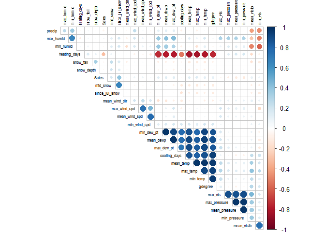<!-- -->


##### Next I want to visualize how these varibles vary with Sales.

```r
doPlots <- function(data_in, fun, ii, ncol=3) {
  pp <- list()
  for (i in ii) {
    p <- fun(data_in=data_in, i=i)
    pp <- c(pp, list(p))
  }
  do.call("grid.arrange", c(pp, ncol=ncol))
}
plotScatter <- function(data_in, i) {
  data <- data.frame(x=data_in[[i]])
  p <- ggplot(data=data, aes(x=x,y=Dallas$Sales)) + geom_point() + xlab(colnames(data_in)[i]) + theme_light() + 
    theme(axis.text.x = element_text(angle = 90, hjust =1),legend.position="none")
  return (p)
}

doPlots(Dallas, fun=plotScatter, ii=c(11:14), ncol=2)
```

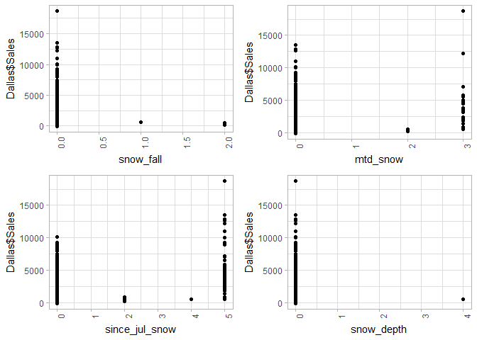<!-- -->

```r
doPlots(Dallas, fun=plotScatter, ii=c(17:22), ncol=2)
```

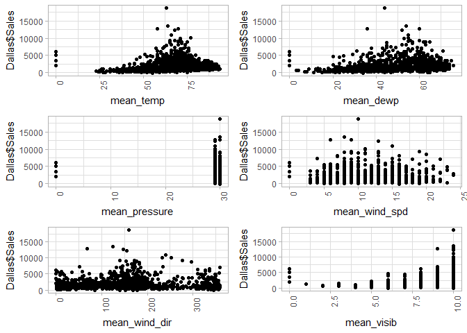<!-- -->

```r
doPlots(Dallas, fun=plotScatter, ii=c(23:28), ncol=2)
```

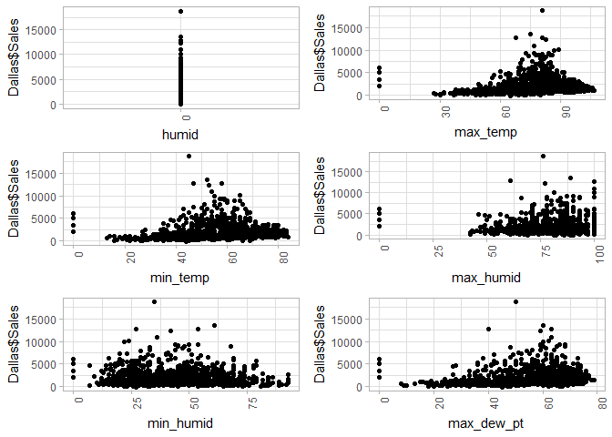<!-- -->

```r
doPlots(Dallas, fun=plotScatter, ii=c(29:34), ncol=2)
```

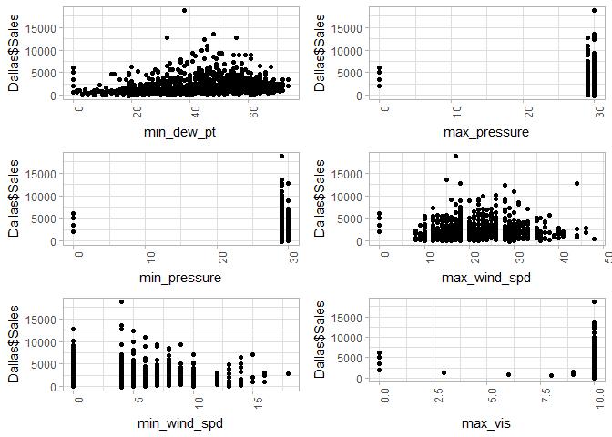<!-- -->

```r
doPlots(Dallas, fun=plotScatter, ii=c(35:39), ncol=2)
```

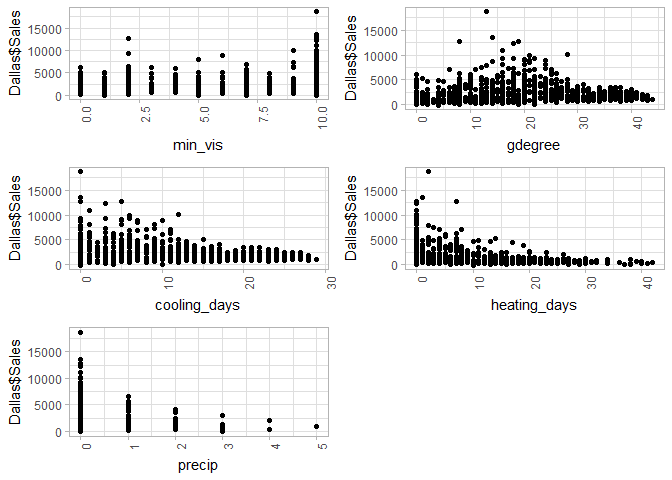<!-- -->


##### Next, I want to create a summary of descriptive statistics for the categorical variables and visualize how they vary with sales.


```r
Dal_fact_vars <- names(Dallas)[which(sapply(Dallas,is.factor))]
Dal_fact_df <- Dallas[Dal_fact_vars]

Dal_summary_stats_fact <- data.frame(vars= colnames(Dal_fact_df),
                                     unique=rapply(Dal_fact_df, function(x)length(unique(x))),
                                     nas=rapply(Dal_fact_df, function(x)round(sum(is.na(x)),3)),
                                     stringsAsFactors=T)

kable(Dal_summary_stats_fact[2:ncol(Dal_summary_stats_fact)])%>%
    kable_styling(bootstrap_options = c("striped", "hover"))
```

<table class="table table-striped table-hover" style="margin-left: auto; margin-right: auto;">
 <thead>
  <tr>
   <th style="text-align:left;">   </th>
   <th style="text-align:right;"> unique </th>
   <th style="text-align:right;"> nas </th>
  </tr>
 </thead>
<tbody>
  <tr>
   <td style="text-align:left;"> Date..Year. </td>
   <td style="text-align:right;"> 4 </td>
   <td style="text-align:right;"> 0 </td>
  </tr>
  <tr>
   <td style="text-align:left;"> Date..Month. </td>
   <td style="text-align:right;"> 12 </td>
   <td style="text-align:right;"> 0 </td>
  </tr>
  <tr>
   <td style="text-align:left;"> WeekOfYear </td>
   <td style="text-align:right;"> 53 </td>
   <td style="text-align:right;"> 0 </td>
  </tr>
  <tr>
   <td style="text-align:left;"> DayOfWeek </td>
   <td style="text-align:right;"> 7 </td>
   <td style="text-align:right;"> 0 </td>
  </tr>
  <tr>
   <td style="text-align:left;"> City </td>
   <td style="text-align:right;"> 1 </td>
   <td style="text-align:right;"> 0 </td>
  </tr>
  <tr>
   <td style="text-align:left;"> HolidayText </td>
   <td style="text-align:right;"> 15 </td>
   <td style="text-align:right;"> 0 </td>
  </tr>
  <tr>
   <td style="text-align:left;"> fog </td>
   <td style="text-align:right;"> 2 </td>
   <td style="text-align:right;"> 0 </td>
  </tr>
  <tr>
   <td style="text-align:left;"> rain </td>
   <td style="text-align:right;"> 2 </td>
   <td style="text-align:right;"> 0 </td>
  </tr>
  <tr>
   <td style="text-align:left;"> snow </td>
   <td style="text-align:right;"> 2 </td>
   <td style="text-align:right;"> 0 </td>
  </tr>
  <tr>
   <td style="text-align:left;"> hail </td>
   <td style="text-align:right;"> 1 </td>
   <td style="text-align:right;"> 0 </td>
  </tr>
  <tr>
   <td style="text-align:left;"> thunder </td>
   <td style="text-align:right;"> 2 </td>
   <td style="text-align:right;"> 0 </td>
  </tr>
  <tr>
   <td style="text-align:left;"> humid </td>
   <td style="text-align:right;"> 1 </td>
   <td style="text-align:right;"> 0 </td>
  </tr>
</tbody>
</table>

```r
plotBox <- function(data_in, i) {
  data <- data.frame(x=data_in[[i]])
  p <- ggplot(data=data, aes(x=factor(x),y=Dallas$Sales, fill=factor(x))) + geom_boxplot() + xlab(colnames(data_in)[i]) + theme_light() + 
    theme(axis.text.x = element_text(angle = 90, hjust =1),legend.position="none")
  return (p)
}

doPlots(Dallas, fun=plotBox, ii=c(1:4), ncol=2)
```

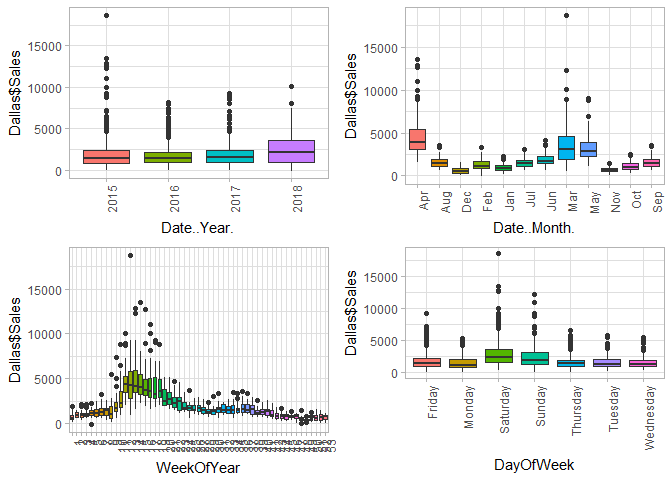<!-- -->

```r
doPlots(Dallas, fun=plotBox, ii=c(8:10), ncol=2)
```

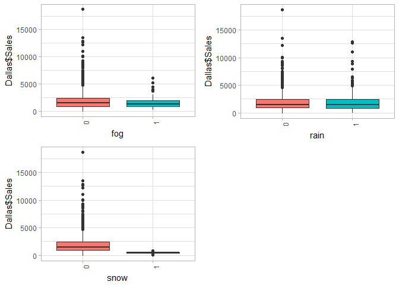<!-- -->

```r
doPlots(Dallas, fun=plotBox, ii=c(6), ncol=1)
```

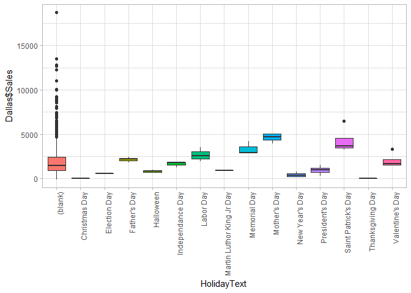<!-- -->


##### I have to decided to drop variables that do not have any information for modeling purposes i.e. they don't vary across the dataset. I have also dropped rows that have no sales since these represent holiday when stores are closed.

```r
Dallas <- subset(Dallas, select = -c(City,humid,mean_pressure,min_pressure,max_pressure,precip))
#Drop Holidays with Zero Sales
Dallas <- Dallas%>%
  filter(Sales>0)
```


## Modeling Section
##### Here I will use Boruta and RFE algorithms to rank my independant variables in terms of importantance. I will later test the predictive powers of the variables chosen by each of these techniques against the full set of data and each other using Lasso Regression and Random Forest Models. 

### Boruta Analysis 
##### This type of algorithm is quite useful for determining variable importance. This algorithm shuffles the predictors' values and joins them back with the original predictors. Then it builds random forests on the merged dataset. Next, a comparison of original variables with the randomised variables is made to measure variable importance. Only variables having higher importance than that of the randomised variables are considered important. I use a great package in R called 'Boruta' that allows the user to rank the variables in terms of importance.

##### Based the results below, it appears that the Date variables Year,Week, Month, and Day are 4 of the 6 highest ranked variables. Since Week of Year and Month are redundant, I only want to use one. I will test them against each other later to see which helps predict sales better. Heating days, Gdegree, and Since July Snow are the three highest ranked weather variables.


```r
library(Boruta)
```

```
## Loading required package: ranger
```

```r
TARGET.VAR <- "Sales"
candidate.features <- setdiff(names(Dallas),c(TARGET.VAR))
# response variables
Dallas.boruta.df <- Dallas[candidate.features]
response <- Dallas$Sales
set.seed(13)
per.bor.results <- Boruta(Dallas.boruta.df, response,
                          maxRuns = 101,
                          doTrace = 0)
per.bor.results
```

Boruta performed 100 iterations in 2.379274 mins.
 25 attributes confirmed important: cooling_days, Date..Month.,
Date..Year., DayOfWeek, gdegree and 20 more;
 4 attributes confirmed unimportant: fog, hail, snow_depth,
snow_fall;
 3 tentative attributes left: max_vis, min_wind_spd, snow;

```r
plot(per.bor.results, xlab = "", xaxt = "n")
k <-lapply(1:ncol(per.bor.results$ImpHistory),function(i)
  per.bor.results$ImpHistory[is.finite(per.bor.results$ImpHistory[,i]),i])
names(k) <- colnames(per.bor.results$ImpHistory)
Labels <- sort(sapply(k,median))
axis(side = 1,las=2,labels = names(Labels),
     at = 1:ncol(per.bor.results$ImpHistory), cex.axis = 0.7)
```

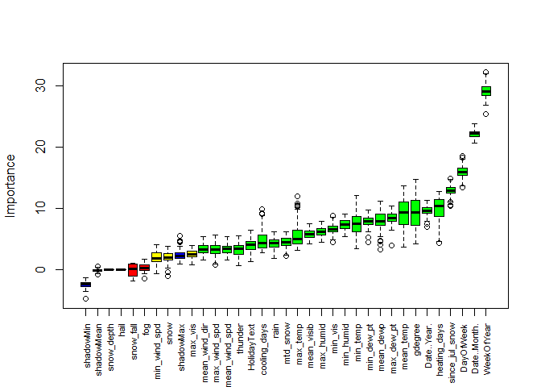<!-- -->


### RFE Analysis

##### I want to use RFE, or Recursive Feature Elimination, to see what its algorithm ranks as the most important features. There appears to be a good bit of overlap with the Boruta model which is good news. This algorithm ranked WeekOfYear, DayOfWeek, since_jul_snow, max_temp, gdegree as the top 5 most important variables.


```r
Dal_Model_df <- Dallas%>%
  select(-c(Date..Month.))

set.seed(100)
Y <- Dal_Model_df$Sales
drop_sales <- c("Sales") 
X_train <- Dal_Model_df[,!(names(Dal_Model_df) %in% drop_sales)]

##### Use Recursive Feature elimination function in Caret to select best features
control <- rfeControl(functions = rfFuncs,
                      method = "repeatedcv",
                      repeats = 3,
                      verbose = FALSE)                                
Dal_rfe <- rfe(x=X_train,y=Y,
               rfeControl = control)

kable(round(Dal_rfe$result,2))%>%
    kable_styling(bootstrap_options = c("striped", "hover"))
```

<table class="table table-striped table-hover" style="margin-left: auto; margin-right: auto;">
 <thead>
  <tr>
   <th style="text-align:right;"> Variables </th>
   <th style="text-align:right;"> RMSE </th>
   <th style="text-align:right;"> Rsquared </th>
   <th style="text-align:right;"> MAE </th>
   <th style="text-align:right;"> RMSESD </th>
   <th style="text-align:right;"> RsquaredSD </th>
   <th style="text-align:right;"> MAESD </th>
  </tr>
 </thead>
<tbody>
  <tr>
   <td style="text-align:right;"> 4 </td>
   <td style="text-align:right;"> 943.01 </td>
   <td style="text-align:right;"> 0.78 </td>
   <td style="text-align:right;"> 576.42 </td>
   <td style="text-align:right;"> 191.56 </td>
   <td style="text-align:right;"> 0.05 </td>
   <td style="text-align:right;"> 54.72 </td>
  </tr>
  <tr>
   <td style="text-align:right;"> 8 </td>
   <td style="text-align:right;"> 866.71 </td>
   <td style="text-align:right;"> 0.80 </td>
   <td style="text-align:right;"> 524.58 </td>
   <td style="text-align:right;"> 185.80 </td>
   <td style="text-align:right;"> 0.05 </td>
   <td style="text-align:right;"> 55.70 </td>
  </tr>
  <tr>
   <td style="text-align:right;"> 16 </td>
   <td style="text-align:right;"> 804.85 </td>
   <td style="text-align:right;"> 0.83 </td>
   <td style="text-align:right;"> 481.62 </td>
   <td style="text-align:right;"> 186.66 </td>
   <td style="text-align:right;"> 0.04 </td>
   <td style="text-align:right;"> 48.24 </td>
  </tr>
  <tr>
   <td style="text-align:right;"> 31 </td>
   <td style="text-align:right;"> 793.60 </td>
   <td style="text-align:right;"> 0.83 </td>
   <td style="text-align:right;"> 475.42 </td>
   <td style="text-align:right;"> 187.47 </td>
   <td style="text-align:right;"> 0.04 </td>
   <td style="text-align:right;"> 50.31 </td>
  </tr>
</tbody>
</table>

```r
varImp(Dal_rfe) %>%
  as.data.frame() %>%
  rownames_to_column() %>%
  arrange(Overall) %>% 
  mutate(rowname = forcats::fct_inorder(rowname)) %>%
  ggplot() +
    geom_col(aes(x = rowname, y = Overall)) +
    ylab("Variable Importance")+
    coord_flip()+
    theme(axis.title.y=element_blank())
```

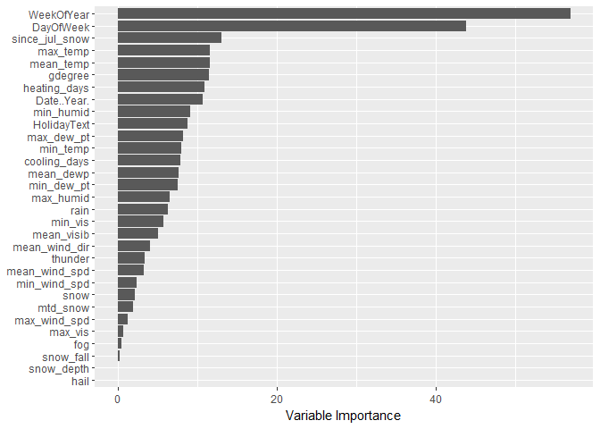<!-- -->


##### For the next steps I plan to run 2 types of models (Lasso, Random Forest) for each of the following 3 scenarios to determine which set of variables best predicts Sales.
1) All independent variables
2) The top 6 variables from the Boruta analysis
3) The top 6 variables from the RFE analysis

##### Based on the results below, the Random Forest model outperformed the Lasso Regression model significantly with a mean R^2 of 82% vs. 71%.


```r
Dal_Model_df <- Dallas%>%
  select(-c(Date..Month.))

Dal_factor_vars <- names(Dal_Model_df)[which(sapply(Dal_Model_df,is.factor))]
Dal_dummies <- dummyVars(~.,Dal_Model_df[Dal_factor_vars])
Dal_1_hot <- predict(Dal_dummies,Dal_Model_df[Dal_factor_vars])

Dal_numeric_vars <- names(Dal_Model_df)[which(sapply(Dal_Model_df,is.numeric))]
Dal_num_df <- Dal_Model_df[Dal_numeric_vars]
Dal_Model_df1 <- cbind(Dal_num_df,Dal_1_hot)
Y_lasso <- Dal_Model_df1$Sales
X_train_lasso <- Dal_Model_df1[,!(names(Dal_Model_df1) %in% drop_sales)]


CARET.TRAIN.CTRL <- trainControl(method="repeatedcv",
                                 number=5,
                                 repeats=5,
                                 verboseIter=FALSE)
##### Lasso #####
Dal_lasso_1 <- train(x=X_train_lasso,y=Y_lasso,
                     method="glmnet",
                     metric="RMSE",
                     maximize=FALSE,
                     trControl=CARET.TRAIN.CTRL,
                     tuneGrid=expand.grid(alpha=1,lambda=seq(0, 100, by = 0.1)))


##### Random Forest #####
tg <- data.frame(mtry= seq(2,30, by=5))
Dal_rf_1 <- train(x=X_train,y=Y,
                  method="rf",
                  metric="RMSE",
                  maximize=FALSE,
                  trControl=CARET.TRAIN.CTRL,
                  tuneGrid = tg)


##### Comparing Models #####
model_list <- list(lasso1=Dal_lasso_1,rf1=Dal_rf_1)
res<-resamples(model_list)

res_table <-as.data.frame(summary(res)$statistics)
```


<table class="table table-striped table-hover" style="margin-left: auto; margin-right: auto;">
 <thead>
  <tr>
   <th style="text-align:left;">   </th>
   <th style="text-align:right;"> RMSE.Min. </th>
   <th style="text-align:right;"> RMSE.1st.Qu. </th>
   <th style="text-align:right;"> RMSE.Median </th>
   <th style="text-align:right;"> RMSE.Mean </th>
   <th style="text-align:right;"> RMSE.3rd.Qu. </th>
   <th style="text-align:right;"> RMSE.Max. </th>
   <th style="text-align:right;"> RMSE.NA.s </th>
  </tr>
 </thead>
<tbody>
  <tr>
   <td style="text-align:left;"> lasso1 </td>
   <td style="text-align:right;"> 827.04 </td>
   <td style="text-align:right;"> 881.64 </td>
   <td style="text-align:right;"> 930.87 </td>
   <td style="text-align:right;"> 957.34 </td>
   <td style="text-align:right;"> 1021.80 </td>
   <td style="text-align:right;"> 1196.92 </td>
   <td style="text-align:right;"> 0 </td>
  </tr>
  <tr>
   <td style="text-align:left;"> rf1 </td>
   <td style="text-align:right;"> 598.58 </td>
   <td style="text-align:right;"> 661.04 </td>
   <td style="text-align:right;"> 732.47 </td>
   <td style="text-align:right;"> 783.25 </td>
   <td style="text-align:right;"> 834.22 </td>
   <td style="text-align:right;"> 1195.26 </td>
   <td style="text-align:right;"> 0 </td>
  </tr>
</tbody>
</table>

<table class="table table-striped table-hover" style="margin-left: auto; margin-right: auto;">
 <thead>
  <tr>
   <th style="text-align:left;">   </th>
   <th style="text-align:right;"> Rsquared.Min. </th>
   <th style="text-align:right;"> Rsquared.1st.Qu. </th>
   <th style="text-align:right;"> Rsquared.Median </th>
   <th style="text-align:right;"> Rsquared.Mean </th>
   <th style="text-align:right;"> Rsquared.3rd.Qu. </th>
   <th style="text-align:right;"> Rsquared.Max. </th>
   <th style="text-align:right;"> Rsquared.NA.s </th>
  </tr>
 </thead>
<tbody>
  <tr>
   <td style="text-align:left;"> lasso1 </td>
   <td style="text-align:right;"> 0.60 </td>
   <td style="text-align:right;"> 0.69 </td>
   <td style="text-align:right;"> 0.73 </td>
   <td style="text-align:right;"> 0.71 </td>
   <td style="text-align:right;"> 0.75 </td>
   <td style="text-align:right;"> 0.77 </td>
   <td style="text-align:right;"> 0 </td>
  </tr>
  <tr>
   <td style="text-align:left;"> rf1 </td>
   <td style="text-align:right;"> 0.72 </td>
   <td style="text-align:right;"> 0.81 </td>
   <td style="text-align:right;"> 0.82 </td>
   <td style="text-align:right;"> 0.82 </td>
   <td style="text-align:right;"> 0.85 </td>
   <td style="text-align:right;"> 0.87 </td>
   <td style="text-align:right;"> 0 </td>
  </tr>
</tbody>
</table>


##### The results below show how the Lasso vs. Random Forest performed with the top 9 variables from the Boruta analysis. Based on theses results, the Random Forest model outperformed the Lasso Regression model significantly with a mean R^2 of 82% vs. 71%.


```r
##### Use Variables from Boruta model to build a models
Dal_Model_df <- Dallas%>%
  select(c(Sales,WeekOfYear,since_jul_snow, Date..Year., heating_days, DayOfWeek,HolidayText,mean_temp,min_humid,max_dew_pt))

Dal_factor_vars <- names(Dal_Model_df)[which(sapply(Dal_Model_df,is.factor))]
Dal_dummies <- dummyVars(~.,Dal_Model_df[Dal_factor_vars])
Dal_1_hot <- predict(Dal_dummies,Dal_Model_df[Dal_factor_vars])

Dal_numeric_vars <- names(Dal_Model_df)[which(sapply(Dal_Model_df,is.numeric))]
Dal_num_df <- Dal_Model_df[Dal_numeric_vars]
Dal_Model_df1 <- cbind(Dal_num_df,Dal_1_hot)

Y <- Dal_Model_df$Sales
Y_lasso <- Dal_Model_df1$Sales
drop_sales <- c("Sales") 
X_train <- Dal_Model_df[,!(names(Dal_Model_df) %in% drop_sales)]
X_train_lasso <- Dal_Model_df1[,!(names(Dal_Model_df1) %in% drop_sales)]

set.seed(100)
CARET.TRAIN.CTRL <- trainControl(method="repeatedcv",
                                 number=5,
                                 repeats=5,
                                 verboseIter=FALSE)
##### Lasso #####
Dal_lasso_2 <- train(x=X_train_lasso,y=Y_lasso,
                     method="glmnet",
                     metric="RMSE",
                     maximize=FALSE,
                     trControl=CARET.TRAIN.CTRL,
                     tuneGrid=expand.grid(alpha=1,lambda=seq(0, 100, by = 0.1)))

##### Random Forest #####
tg <- data.frame(mtry= seq(2,10, by=2))
Dal_rf_2 <- train(x=X_train,y=Y,
                  method="rf",
                  metric="RMSE",
                  maximize=FALSE,
                  importance = TRUE,
                  trControl=CARET.TRAIN.CTRL,
                  tuneGrid = tg)


##### Comparing new model with Boruta features 
model_list2 <- list(lasso2=Dal_lasso_2,rf2=Dal_rf_2)
res2<-resamples(model_list2)
res2_table <-as.data.frame(summary(res2)$statistics)
```
<table class="table table-striped table-hover" style="margin-left: auto; margin-right: auto;">
 <thead>
  <tr>
   <th style="text-align:left;">   </th>
   <th style="text-align:right;"> RMSE.Min. </th>
   <th style="text-align:right;"> RMSE.1st.Qu. </th>
   <th style="text-align:right;"> RMSE.Median </th>
   <th style="text-align:right;"> RMSE.Mean </th>
   <th style="text-align:right;"> RMSE.3rd.Qu. </th>
   <th style="text-align:right;"> RMSE.Max. </th>
   <th style="text-align:right;"> RMSE.NA.s </th>
  </tr>
 </thead>
<tbody>
  <tr>
   <td style="text-align:left;"> lasso2 </td>
   <td style="text-align:right;"> 731.52 </td>
   <td style="text-align:right;"> 897.65 </td>
   <td style="text-align:right;"> 965.50 </td>
   <td style="text-align:right;"> 986.15 </td>
   <td style="text-align:right;"> 1061.58 </td>
   <td style="text-align:right;"> 1225.57 </td>
   <td style="text-align:right;"> 0 </td>
  </tr>
  <tr>
   <td style="text-align:left;"> rf2 </td>
   <td style="text-align:right;"> 528.38 </td>
   <td style="text-align:right;"> 647.83 </td>
   <td style="text-align:right;"> 764.86 </td>
   <td style="text-align:right;"> 782.63 </td>
   <td style="text-align:right;"> 919.65 </td>
   <td style="text-align:right;"> 1074.78 </td>
   <td style="text-align:right;"> 0 </td>
  </tr>
</tbody>
</table>

<table class="table table-striped table-hover" style="margin-left: auto; margin-right: auto;">
 <thead>
  <tr>
   <th style="text-align:left;">   </th>
   <th style="text-align:right;"> Rsquared.Min. </th>
   <th style="text-align:right;"> Rsquared.1st.Qu. </th>
   <th style="text-align:right;"> Rsquared.Median </th>
   <th style="text-align:right;"> Rsquared.Mean </th>
   <th style="text-align:right;"> Rsquared.3rd.Qu. </th>
   <th style="text-align:right;"> Rsquared.Max. </th>
   <th style="text-align:right;"> Rsquared.NA.s </th>
  </tr>
 </thead>
<tbody>
  <tr>
   <td style="text-align:left;"> lasso2 </td>
   <td style="text-align:right;"> 0.63 </td>
   <td style="text-align:right;"> 0.68 </td>
   <td style="text-align:right;"> 0.70 </td>
   <td style="text-align:right;"> 0.70 </td>
   <td style="text-align:right;"> 0.73 </td>
   <td style="text-align:right;"> 0.76 </td>
   <td style="text-align:right;"> 0 </td>
  </tr>
  <tr>
   <td style="text-align:left;"> rf2 </td>
   <td style="text-align:right;"> 0.72 </td>
   <td style="text-align:right;"> 0.81 </td>
   <td style="text-align:right;"> 0.83 </td>
   <td style="text-align:right;"> 0.82 </td>
   <td style="text-align:right;"> 0.83 </td>
   <td style="text-align:right;"> 0.87 </td>
   <td style="text-align:right;"> 0 </td>
  </tr>
</tbody>
</table>
 
 
 
##### The results below show how the Lasso vs. Random Forest models performed with the top 9 variables from the RFE analysis versus the previous 4 model above. Based on theses results, the Random Forest model outperformed the Lasso Regression model significantly with a mean R^2 of 82% vs. 71%.The results also point to the fact that a reduction in the number of variables used doesn't have a significant effect in the predictive power of the Random Forest model. We can see that the mean RMSE and mean R^2 values decreasing very slightly from the full set of variables to the variables chosen by the Boruta and RFE algorithms.


```r
##### Use Variables from RFE to build a Models
Dal_Model_df <- Dallas%>%
  select(c(Sales,since_jul_snow, Date..Year.,DayOfWeek,Date..Month.,max_temp,gdegree, min_humid,HolidayText,heating_days,max_dew_pt))

Dal_factor_vars <- names(Dal_Model_df)[which(sapply(Dal_Model_df,is.factor))]
Dal_dummies <- dummyVars(~.,Dal_Model_df[Dal_factor_vars])
Dal_1_hot <- predict(Dal_dummies,Dal_Model_df[Dal_factor_vars])

Dal_numeric_vars <- names(Dal_Model_df)[which(sapply(Dal_Model_df,is.numeric))]
Dal_num_df <- Dal_Model_df[Dal_numeric_vars]
Dal_Model_df1 <- cbind(Dal_num_df,Dal_1_hot)

Y <- Dal_Model_df$Sales
Y_lasso <- Dal_Model_df1$Sales
drop_sales <- c("Sales") 
X_train <- Dal_Model_df[,!(names(Dal_Model_df) %in% drop_sales)]
X_train_lasso <- Dal_Model_df1[,!(names(Dal_Model_df1) %in% drop_sales)]

##### Lasso #####
set.seed(100)
CARET.TRAIN.CTRL <- trainControl(method="repeatedcv",
                                 number=5,
                                 repeats=5,
                                 verboseIter=FALSE)
Dal_lasso_3 <- train(x=X_train_lasso,y=Y_lasso,
                     method="glmnet",
                     metric="RMSE",
                     maximize=FALSE,
                     trControl=CARET.TRAIN.CTRL,
                     tuneGrid=expand.grid(alpha=1,lambda=seq(0, 100, by = 0.1)))

##### Random Forest #####
tg <- data.frame(mtry= seq(1,10, by=2))
Dal_rf_3 <- train(x=X_train,y=Y,
                  method="rf",
                  metric="RMSE",
                  maximize=FALSE,
                  importance = TRUE,
                  trControl=CARET.TRAIN.CTRL,
                  tuneGrid = tg)


model_list5 <- list(lasso1=Dal_lasso_1,lasso2=Dal_lasso_2,lasso3=Dal_lasso_3, 
                    rf1=Dal_rf_1,rf2=Dal_rf_2,rf3=Dal_rf_3)
res5<-resamples(model_list5)

res5_table <-as.data.frame(summary(res5)$statistics)
```
<table class="table table-striped table-hover" style="margin-left: auto; margin-right: auto;">
 <thead>
  <tr>
   <th style="text-align:left;">   </th>
   <th style="text-align:right;"> RMSE.Min. </th>
   <th style="text-align:right;"> RMSE.1st.Qu. </th>
   <th style="text-align:right;"> RMSE.Median </th>
   <th style="text-align:right;"> RMSE.Mean </th>
   <th style="text-align:right;"> RMSE.3rd.Qu. </th>
   <th style="text-align:right;"> RMSE.Max. </th>
   <th style="text-align:right;"> RMSE.NA.s </th>
  </tr>
 </thead>
<tbody>
  <tr>
   <td style="text-align:left;"> lasso1 </td>
   <td style="text-align:right;"> 827.04 </td>
   <td style="text-align:right;"> 881.64 </td>
   <td style="text-align:right;"> 930.87 </td>
   <td style="text-align:right;"> 957.34 </td>
   <td style="text-align:right;"> 1021.80 </td>
   <td style="text-align:right;"> 1196.92 </td>
   <td style="text-align:right;"> 0 </td>
  </tr>
  <tr>
   <td style="text-align:left;"> lasso2 </td>
   <td style="text-align:right;"> 731.52 </td>
   <td style="text-align:right;"> 897.65 </td>
   <td style="text-align:right;"> 965.50 </td>
   <td style="text-align:right;"> 986.15 </td>
   <td style="text-align:right;"> 1061.58 </td>
   <td style="text-align:right;"> 1225.57 </td>
   <td style="text-align:right;"> 0 </td>
  </tr>
  <tr>
   <td style="text-align:left;"> lasso3 </td>
   <td style="text-align:right;"> 718.19 </td>
   <td style="text-align:right;"> 925.72 </td>
   <td style="text-align:right;"> 1021.49 </td>
   <td style="text-align:right;"> 1023.59 </td>
   <td style="text-align:right;"> 1107.34 </td>
   <td style="text-align:right;"> 1309.14 </td>
   <td style="text-align:right;"> 0 </td>
  </tr>
  <tr>
   <td style="text-align:left;"> rf1 </td>
   <td style="text-align:right;"> 598.58 </td>
   <td style="text-align:right;"> 661.04 </td>
   <td style="text-align:right;"> 732.47 </td>
   <td style="text-align:right;"> 783.25 </td>
   <td style="text-align:right;"> 834.22 </td>
   <td style="text-align:right;"> 1195.26 </td>
   <td style="text-align:right;"> 0 </td>
  </tr>
  <tr>
   <td style="text-align:left;"> rf2 </td>
   <td style="text-align:right;"> 528.38 </td>
   <td style="text-align:right;"> 647.83 </td>
   <td style="text-align:right;"> 764.86 </td>
   <td style="text-align:right;"> 782.63 </td>
   <td style="text-align:right;"> 919.65 </td>
   <td style="text-align:right;"> 1074.78 </td>
   <td style="text-align:right;"> 0 </td>
  </tr>
  <tr>
   <td style="text-align:left;"> rf3 </td>
   <td style="text-align:right;"> 563.08 </td>
   <td style="text-align:right;"> 673.85 </td>
   <td style="text-align:right;"> 796.30 </td>
   <td style="text-align:right;"> 769.26 </td>
   <td style="text-align:right;"> 837.02 </td>
   <td style="text-align:right;"> 1011.40 </td>
   <td style="text-align:right;"> 0 </td>
  </tr>
</tbody>
</table>

<table class="table table-striped table-hover" style="margin-left: auto; margin-right: auto;">
 <thead>
  <tr>
   <th style="text-align:left;">   </th>
   <th style="text-align:right;"> Rsquared.Min. </th>
   <th style="text-align:right;"> Rsquared.1st.Qu. </th>
   <th style="text-align:right;"> Rsquared.Median </th>
   <th style="text-align:right;"> Rsquared.Mean </th>
   <th style="text-align:right;"> Rsquared.3rd.Qu. </th>
   <th style="text-align:right;"> Rsquared.Max. </th>
   <th style="text-align:right;"> Rsquared.NA.s </th>
  </tr>
 </thead>
<tbody>
  <tr>
   <td style="text-align:left;"> lasso1 </td>
   <td style="text-align:right;"> 0.60 </td>
   <td style="text-align:right;"> 0.69 </td>
   <td style="text-align:right;"> 0.73 </td>
   <td style="text-align:right;"> 0.71 </td>
   <td style="text-align:right;"> 0.75 </td>
   <td style="text-align:right;"> 0.77 </td>
   <td style="text-align:right;"> 0 </td>
  </tr>
  <tr>
   <td style="text-align:left;"> lasso2 </td>
   <td style="text-align:right;"> 0.63 </td>
   <td style="text-align:right;"> 0.68 </td>
   <td style="text-align:right;"> 0.70 </td>
   <td style="text-align:right;"> 0.70 </td>
   <td style="text-align:right;"> 0.73 </td>
   <td style="text-align:right;"> 0.76 </td>
   <td style="text-align:right;"> 0 </td>
  </tr>
  <tr>
   <td style="text-align:left;"> lasso3 </td>
   <td style="text-align:right;"> 0.58 </td>
   <td style="text-align:right;"> 0.65 </td>
   <td style="text-align:right;"> 0.68 </td>
   <td style="text-align:right;"> 0.68 </td>
   <td style="text-align:right;"> 0.71 </td>
   <td style="text-align:right;"> 0.73 </td>
   <td style="text-align:right;"> 0 </td>
  </tr>
  <tr>
   <td style="text-align:left;"> rf1 </td>
   <td style="text-align:right;"> 0.72 </td>
   <td style="text-align:right;"> 0.81 </td>
   <td style="text-align:right;"> 0.82 </td>
   <td style="text-align:right;"> 0.82 </td>
   <td style="text-align:right;"> 0.85 </td>
   <td style="text-align:right;"> 0.87 </td>
   <td style="text-align:right;"> 0 </td>
  </tr>
  <tr>
   <td style="text-align:left;"> rf2 </td>
   <td style="text-align:right;"> 0.72 </td>
   <td style="text-align:right;"> 0.81 </td>
   <td style="text-align:right;"> 0.83 </td>
   <td style="text-align:right;"> 0.82 </td>
   <td style="text-align:right;"> 0.83 </td>
   <td style="text-align:right;"> 0.87 </td>
   <td style="text-align:right;"> 0 </td>
  </tr>
  <tr>
   <td style="text-align:left;"> rf3 </td>
   <td style="text-align:right;"> 0.77 </td>
   <td style="text-align:right;"> 0.80 </td>
   <td style="text-align:right;"> 0.82 </td>
   <td style="text-align:right;"> 0.82 </td>
   <td style="text-align:right;"> 0.84 </td>
   <td style="text-align:right;"> 0.88 </td>
   <td style="text-align:right;"> 0 </td>
  </tr>
</tbody>
</table>


